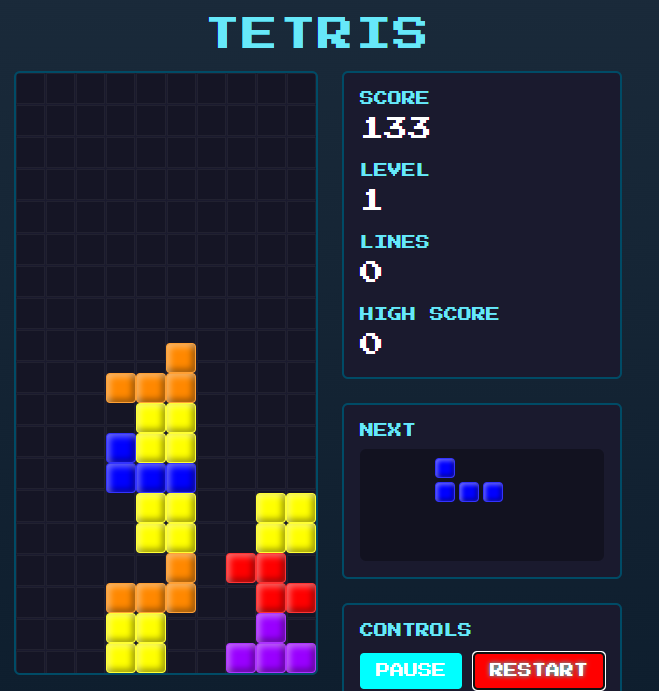

# Cosmic Tetris

Классическая игра Тетрис с космической темой, реализованная на React и TypeScript.



## 🌌 Особенности

- Классический геймплей Тетрис с 7 стандартными фигурами (I, J, L, O, S, T, Z)
- Космический дизайн с анимированными звездами и эффектами свечения
- Синтезированная фоновая музыка в стиле 8-bit через Web Audio API
- Адаптивный дизайн для мобильных устройств с сенсорными элементами управления
- Подсчет очков, отслеживание уровня и количества убранных линий
- Сохранение рекорда в localStorage
- Звуковые эффекты для движений, вращений и очистки линий

## 🎮 Управление

### Клавиатура (ПК):
- **Стрелки влево/вправо**: Перемещение фигуры по горизонтали
- **Стрелка вверх**: Вращение фигуры
- **Стрелка вниз**: Мягкое падение (ускоренное)
- **Пробел**: Жесткое падение (мгновенное)

### Сенсорное управление (Мобильные устройства):
- Экранные кнопки управления для перемещения, вращения и падения

## 🧩 Технологии

- React
- TypeScript
- TailwindCSS
- Web Audio API для синтезированной музыки
- localStorage для сохранения рекордов

## 📈 Механика игры

- Игра начинается с уровня 1
- Скорость падения фигур увеличивается с каждым новым уровнем
- Уровень повышается за каждые 10 очищенных линий
- Очки начисляются за:
  - Падение фигуры: 1 очко за ячейку
  - Очистка линий: 40/100/300/1200 очков за 1/2/3/4 линии соответственно, умноженное на текущий уровень

## 🚀 Как запустить

```bash
# Установка зависимостей
npm install

# Запуск в режиме разработки
npm run dev
```

## 🎬 Структура проекта

- `client/src/pages/TetrisGame.tsx` - Основной компонент игры
- `client/src/hooks/use-tetris.ts` - Хук, содержащий логику игры
- `client/src/lib/tetris.ts` - Основные функции и константы для Тетриса
- `client/src/components/game/` - Компоненты игры:
  - `BackgroundMusic.tsx` - Компонент фоновой музыки
  - `GameBoard.tsx` - Игровое поле
  - `InfoPanel.tsx` - Панель с информацией (счет, уровень и т.д.)
  - `NextPiece.tsx` - Предпросмотр следующей фигуры
  - `Controls.tsx` - Элементы управления игрой

---

© 2025 Cosmic Tetris
